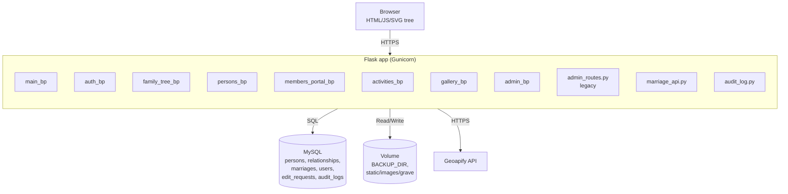

# SRS — Đặc tả yêu cầu phần mềm hệ thống Gia phả TBQC

> **Software Requirements Specification** cho dự án `tbqc` (Flask + MySQL).
> Phiên bản: 1.0 — Cập nhật: 2026-04-21.
> Tài liệu này tuân theo khung IEEE-830 và áp dụng các nguyên tắc Requirements Engineering: Elicitation, Analysis, Specification, Validation & Verification, Use Case Modeling.

---

## Mục lục

1. [Giới thiệu](#1-giới-thiệu)
2. [Mô tả chung](#2-mô-tả-chung)
3. [Kỹ thuật thu thập yêu cầu (Elicitation)](#3-kỹ-thuật-thu-thập-yêu-cầu-elicitation)
4. [Yêu cầu chức năng (Functional Requirements)](#4-yêu-cầu-chức-năng-functional-requirements)
5. [Yêu cầu phi chức năng (Non-Functional Requirements)](#5-yêu-cầu-phi-chức-năng-non-functional-requirements)
6. [Use Case Modeling & UML](#6-use-case-modeling--uml)
7. [Mô hình dữ liệu](#7-mô-hình-dữ-liệu)
8. [Kiến trúc triển khai & vận hành](#8-kiến-trúc-triển-khai--vận-hành)
9. [Validation & Verification](#9-validation--verification)
10. [Ma trận truy vết yêu cầu (Traceability Matrix)](#10-ma-trận-truy-vết-yêu-cầu-traceability-matrix)
11. [Phụ lục](#11-phụ-lục)

---

## 1. Giới thiệu

### 1.1. Mục đích

Tài liệu này đặc tả chi tiết các yêu cầu chức năng, phi chức năng, và quy tắc vận hành của **hệ thống Gia phả TBQC** — một ứng dụng web phục vụ quản lý, tra cứu và chia sẻ thông tin dòng họ, bao gồm cây gia phả tương tác, cổng thành viên, quản trị, tài liệu, hoạt động và bản đồ mộ phần.

Tài liệu hướng đến:

- **Developer / Maintainer** — làm căn cứ thiết kế, hiện thực và kiểm thử.
- **QA / Tester** — làm căn cứ xây dựng test case và kịch bản nghiệm thu.
- **Admin / Ban gia phả** — hiểu luồng nghiệp vụ để vận hành đúng quy trình.
- **Stakeholder** (trưởng tộc, thành viên dòng họ) — xác nhận hệ thống đáp ứng nhu cầu.

### 1.2. Phạm vi

Hệ thống **tbqc** (Tộc Bùi Quang Chính — ví dụ) cung cấp:

- Cây gia phả tương tác nhiều đời, đa chế độ xem (cây, danh sách đa cấp, mindmap).
- Cổng đăng nhập thành viên (passphrase) với quyền xem, xuất Excel, đề xuất chỉnh sửa.
- Bảng quản trị cho admin: CRUD người, duyệt yêu cầu sửa, backup DB, đồng bộ tài khoản.
- Module mộ phần với bản đồ (Geoapify) và ảnh.
- Module hoạt động/tin tức và quản lý tài liệu.

### 1.3. Thuật ngữ và viết tắt

| Thuật ngữ | Ý nghĩa |
|-----------|---------|
| SRS | Software Requirements Specification |
| FR | Functional Requirement — yêu cầu chức năng |
| NFR | Non-Functional Requirement — yêu cầu phi chức năng |
| UC | Use Case |
| V&V | Validation & Verification |
| RBAC | Role-Based Access Control — phân quyền theo vai trò |
| PII | Personally Identifiable Information — thông tin định danh cá nhân |
| Person | Một cá nhân trong gia phả (bảng `persons`) |
| Generation | Đời (thế hệ), cột `generation_level` |
| Branch | Nhánh của dòng họ (bảng `branches`) |
| Passphrase | Chuỗi bí mật dùng để vào cổng members/genealogy |

### 1.4. Tài liệu tham chiếu

- `docs/operations/runbook.md` — Hướng dẫn developer, cấu hình, deploy.
- `CLAUDE.md` — Quy ước phát triển.
- `docs/qa/genealogy-qa-checklist.md` — Checklist kiểm thử hồi quy.
- `docs/product/rollout/genealogy-rollout.md` — Kế hoạch triển khai theo giai đoạn.
- `folder_sql/reset_schema_tbqc.sql` — Schema dữ liệu chuẩn.
- `.env.example` — Mẫu biến môi trường.

---

## 2. Mô tả chung

### 2.1. Bối cảnh sản phẩm

Trước khi số hóa, thông tin dòng họ được lưu trong sổ giấy và file Excel rời rạc, gây khó khăn khi tra cứu tổ tiên/hậu duệ, cập nhật thành viên mới, quản lý mộ phần, và bảo toàn dữ liệu qua thời gian. Hệ thống Gia phả TBQC thay thế các nguồn rời rạc đó bằng một nền tảng web tập trung, truy cập được qua internet, có phân quyền, có audit log và có cơ chế backup.

### 2.2. Các nhóm người dùng (Actors)

| Actor | Mô tả | Cách truy cập |
|-------|-------|---------------|
| **Guest** (Khách) | Chưa đăng nhập | Xem trang chủ, hoạt động, tài liệu công khai |
| **Member** (Thành viên) | Người trong dòng họ, có passphrase | Cổng `/members`, cây gia phả đầy đủ, xuất Excel, gửi yêu cầu sửa |
| **Editor** (Cộng tác) | Member được cấp quyền đăng bài | Đăng hoạt động/tin tức qua `/editor` |
| **Admin** | Quản trị hệ thống | Toàn bộ `/admin/*`, CRUD, backup, duyệt yêu cầu |
| **System/Cron** | Tác vụ nền | Backup định kỳ, cache refresh |

### 2.3. Giả định và ràng buộc

- MySQL 8.x, Python 3.11+.
- Triển khai trên nền tảng hỗ trợ biến môi trường và volume persistent (Railway, VPS, …).
- Dữ liệu gia phả là **PII** — không được công khai toàn bộ khi chưa xác thực.
- Ngôn ngữ chính: tiếng Việt (UTF-8, `utf8mb4_unicode_ci`).
- Hệ thống sử dụng một database MySQL duy nhất; không có sharding trong giai đoạn hiện tại.

---

## 3. Kỹ thuật thu thập yêu cầu (Elicitation)

Các kỹ thuật đã được áp dụng để lập ra bản SRS này:

| Kỹ thuật | Stakeholder | Kết quả đầu ra |
|---|---|---|
| **Interview** 1-1 | Trưởng tộc | Quy tắc đời/nhánh, quy tắc hôn nhân (có nhiều vợ/chồng), quyền xem nhạy cảm |
| **Document analysis** | Ban gia phả | 3 CSV gốc (`person.csv`, `father_mother.csv`, `spouse_sibling_children.csv`) → schema `persons`, `relationships`, `marriages` |
| **Workshop** | Ban gia phả + Dev | Thống nhất chế độ xem (cây/danh sách/mindmap), phân loại nhánh |
| **Observation** | Thành viên cao tuổi | Cách đọc gia phả truyền thống → chức năng xem theo **đời** (`/api/generations`) |
| **Prototyping** | Trưởng tộc | Ảnh `tree-default-view.png`, `tree-zoomed.png` để duyệt phối cảnh |
| **Questionnaire** | Thành viên | Nhu cầu tìm kiếm, xuất Excel, cập nhật thông tin cá nhân |
| **Brainstorming** | Dev | Module mộ phần + Geoapify, module hoạt động, audit log |
| **Reverse engineering** | Dev | File Excel cũ, quyển gia phả giấy → sinh schema và quy tắc import |

**Nguyên tắc:** Mọi yêu cầu được liệt kê trong tài liệu này phải truy ngược được về ít nhất một nguồn elicitation ở bảng trên.

---

## 4. Yêu cầu chức năng (Functional Requirements)

Yêu cầu chức năng được đánh mã `FR-<Module>-<Số>`. Mỗi FR có **ID, mô tả, actor, input, output, tiêu chí chấp nhận**.

### 4.1. Module `main` — Trang công khai

| ID | Mô tả | Actor | Endpoint / Nguồn | Tiêu chí chấp nhận |
|---|---|---|---|---|
| FR-MAIN-01 | Hiển thị trang chủ với giới thiệu dòng họ | Guest | `GET /` | Trang load < 2s; không yêu cầu đăng nhập |
| FR-MAIN-02 | Hiển thị trang Gia phả với cổng passphrase | Guest | `GET /genealogy` | Hiện form passphrase nếu chưa có session hợp lệ |
| FR-MAIN-03 | Xác thực passphrase để mở nội dung gia phả | Guest | `POST /api/genealogy/verify-passphrase` | Trả `200 {ok: true}` nếu passphrase khớp `GENEALOGY_PASSPHRASES`; `401` nếu sai; rate-limit ≥ 5 lần sai trong 5 phút |
| FR-MAIN-04 | Trang liên hệ | Guest | `GET /contact` | Hiện form/thông tin liên hệ |
| FR-MAIN-05 | Trang tài liệu | Guest | `GET /documents` | Liệt kê tài liệu công khai |

### 4.2. Module `auth` — Xác thực

| ID | Mô tả | Actor | Endpoint | Tiêu chí chấp nhận |
|---|---|---|---|---|
| FR-AUTH-01 | Đăng nhập bằng username + password | Admin/Editor | `POST /api/login` | So khớp `password_hash` bảng `users`; trả cookie session |
| FR-AUTH-02 | Đăng xuất | Logged-in user | `POST /api/logout` | Hủy session; chuyển về `/` |
| FR-AUTH-03 | Lấy thông tin người dùng hiện tại | Logged-in user | `GET /api/current-user` | Trả `{username, role, full_name}` hoặc `401` |
| FR-AUTH-04 | Trang login UI | Guest | `GET /login`, `GET /admin/login-page` | Hiển thị form |

### 4.3. Module `family_tree` — Cây gia phả

| ID | Mô tả | Actor | Endpoint | Tiêu chí chấp nhận |
|---|---|---|---|---|
| FR-TREE-01 | Lấy toàn bộ dữ liệu cây gia phả | Member | `GET /api/family-tree` | JSON chứa tất cả person + quan hệ cha-mẹ-con |
| FR-TREE-02 | Lấy danh sách quan hệ cha-mẹ-con | Member | `GET /api/relationships` | Mỗi bản ghi có `parent_id`, `child_id`, `relation_type` |
| FR-TREE-03 | Lấy danh sách con của một người | Member | `GET /api/children/<parent_id>` | Chỉ trả `child_id` có `parent_id` match |
| FR-TREE-04 | Đồng bộ lại cây từ dữ liệu nguồn | Admin | `POST /api/genealogy/sync` | Ghi audit log; cache invalidate |
| FR-TREE-05 | Xem cây dạng thu gọn/đầy đủ | Member | `GET /api/tree` | Tham số đời tùy chọn; trả cấu trúc lồng |
| FR-TREE-06 | Liệt kê tổ tiên của một người | Member | `GET /api/ancestors/<id>` | Truy vết ngược `relationships` đến đời 1 |
| FR-TREE-07 | Liệt kê hậu duệ của một người | Member | `GET /api/descendants/<id>` | Truy vết xuôi đến lá |
| FR-TREE-08 | Liệt kê các đời (generations) | Member | `GET /api/generations` | Trả số đời, mô tả, đếm người mỗi đời |

### 4.4. Module `persons` — Hồ sơ cá nhân

| ID | Mô tả | Actor | Endpoint | Tiêu chí chấp nhận |
|---|---|---|---|---|
| FR-PERSON-01 | Danh sách tất cả người | Member | `GET /api/persons` | Phân trang nếu > 500 bản ghi |
| FR-PERSON-02 | Chi tiết 1 người | Member | `GET /api/person/<id>` | Bao gồm cha/mẹ, vợ/chồng, con, mộ phần |
| FR-PERSON-03 | Tìm kiếm theo tên/năm sinh | Member | `GET /api/search?q=` | Hỗ trợ tiếng Việt có dấu/không dấu; giới hạn 50 kết quả |
| FR-PERSON-04 | Tạo person mới | Admin | `POST /api/persons` | Validate bắt buộc `full_name`; sinh `person_id` theo quy tắc `P-<gen>-<seq>` |
| FR-PERSON-05 | Sá»­a person | Admin | `PUT /api/person/<id>` | Ghi `updated_at`; ghi audit log |
| FR-PERSON-06 | Xoá person | Admin | `DELETE /api/person/<id>` | Cascade xoá `relationships`, `marriages`; cảnh báo nếu còn hậu duệ |
| FR-PERSON-07 | Xoá hàng loạt | Admin | `DELETE /api/persons/batch` | Yêu cầu xác nhận 2 bước; audit log |
| FR-PERSON-08 | Gửi yêu cầu sửa thông tin | Member/Guest | `POST /api/edit-requests` | Ghi vào `edit_requests` với `status='pending'` |

### 4.5. Module `members_portal` — Cổng thành viên

| ID | Mô tả | Actor | Endpoint | Tiêu chí chấp nhận |
|---|---|---|---|---|
| FR-MEM-01 | Trang cổng thành viên | Member | `GET /members` | Check session passphrase; nếu không có → form nhập |
| FR-MEM-02 | Xác thực passphrase vào cổng | Guest | `POST /members/verify` | So với `MEMBERS_PASSWORD` hoặc `MEMBERS_FIXED_ACCOUNTS` |
| FR-MEM-03 | Danh sách thành viên JSON (có cache) | Member | `GET /api/members` | Cache tối thiểu 60s; invalidate khi admin sửa person |
| FR-MEM-04 | Xuất Excel danh sách thành viên | Member | `GET /members/export/excel` | File `.xlsx` ≥ 1MB hợp lệ; có cột đầy đủ |
| FR-MEM-05 | Cập nhật nhánh hàng loạt | Admin | `POST /api/members/bulk-update-branch` | Validate danh sách `person_id`; ghi audit |

### 4.6. Module `activities` — Hoạt động / Tin tức

| ID | Mô tả | Actor | Endpoint | Tiêu chí chấp nhận |
|---|---|---|---|---|
| FR-ACT-01 | Danh sách hoạt động | Guest | `GET /activities` | Chỉ hiện `status='published'`; phân trang |
| FR-ACT-02 | Chi tiết hoạt động | Guest | `GET /activities/<id>` | 404 nếu `draft` và guest |
| FR-ACT-03 | Trình soạn thảo | Editor | `GET /editor` | Check quyền đăng |
| FR-ACT-04 | Kiểm tra quyền đăng | Editor | `GET /api/activities/can-post` | Trả `{can_post: bool, reason}` |
| FR-ACT-05 | Mở quyền bằng mật khẩu session | Editor | `POST /api/activities/post-login` | So với mật khẩu cấu hình |
| FR-ACT-06 | CRUD hoạt động | Editor/Admin | `GET/POST /api/activities`, `GET/PUT/DELETE /api/activities/<id>` | Kiểm quyền; audit log với thao tác ghi |

### 4.7. Module `gallery` — Ảnh và Mộ phần

| ID | Mô tả | Actor | Endpoint | Tiêu chí chấp nhận |
|---|---|---|---|---|
| FR-GAL-01 | Lấy API key Geoapify an toàn | Member | `GET /api/geoapify-key` | Chỉ trả khi có session hợp lệ |
| FR-GAL-02 | Cập nhật vị trí mộ | Admin | `POST /api/grave/update-location` | Lưu vào cột `grave_location`; validate lat/lng |
| FR-GAL-03 | Upload ảnh mộ | Admin | `POST /api/grave/upload-image` | Accept jpg/png ≤ 10MB; lưu vào volume; path vào `grave_image` |
| FR-GAL-04 | Xoá ảnh mộ | Admin | Tuỳ endpoint cấu hình | Yêu cầu `GRAVE_IMAGE_DELETE_PASSWORD` |
| FR-GAL-05 | Phục vụ ảnh tĩnh | All | `GET /static/images/<path>`, `GET /images/<path>` | Cache-Control phù hợp; chặn directory traversal |
| FR-GAL-06 | CRUD album | Admin/Editor | `GET/POST /api/albums`, … | Mật khẩu album (`ALBUM_PASSWORD`) nếu cấu hình |

### 4.8. Module `admin` — Quản trị

| ID | Mô tả | Actor | Endpoint | Tiêu chí chấp nhận |
|---|---|---|---|---|
| FR-ADM-01 | Đồng bộ tài khoản từ env | Admin | `POST /api/admin/sync-tbqc-accounts` | Upsert `users` theo `MEMBERS_FIXED_ACCOUNTS` |
| FR-ADM-02 | Quản lý users | Admin | `GET/POST /api/admin/users` | Tạo/sửa; lưu `password_hash`; không lưu plaintext |
| FR-ADM-03 | Backup DB thủ công | Admin | `POST /api/admin/backup` | Sinh file `.sql.gz` vào `BACKUP_DIR`; đặt mật khẩu bằng `BACKUP_PASSWORD` |
| FR-ADM-04 | Liệt kê backup | Admin | `GET /api/admin/backups` | Danh sách file + kích thước + timestamp |
| FR-ADM-05 | Tải backup | Admin | `GET /api/admin/backup/<filename>` | Chặn path traversal; audit log |
| FR-ADM-06 | Duyệt yêu cầu sửa | Admin | Cập nhật `edit_requests.status` | `approved → processed` khi áp dụng thay đổi |
| FR-ADM-07 | Trang dashboard | Admin | `GET /admin/dashboard` | Thống kê tổng quan (số người, số nhánh, số yêu cầu pending) |

### 4.9. Module `audit_log` — Nhật ký

| ID | Mô tả | Actor | Endpoint | Tiêu chí chấp nhận |
|---|---|---|---|---|
| FR-LOG-01 | Ghi nhật ký mọi thao tác ghi dữ liệu | System | Nội bộ (`audit_log.py`) | Mỗi action ghi: `user_id`, `action`, `target`, `timestamp`, `ip`, `details` |
| FR-LOG-02 | Xem nhật ký | Admin | `GET /admin/activity-logs` | Lọc theo user/thời gian/loại hành động |

### 4.10. Module `health` — Vận hành

| ID | Mô tả | Actor | Endpoint | Tiêu chí chấp nhận |
|---|---|---|---|---|
| FR-HEALTH-01 | Kiểm tra sức khoẻ hệ thống | System | `GET /api/health` | Trả `{status: ok, db: ok}`; 503 nếu DB fail |
| FR-HEALTH-02 | Thống kê hệ thống | Admin | `GET /api/stats` | Tổng person, tổng user, uptime |

---

## 5. Yêu cầu phi chức năng (Non-Functional Requirements)

Mã: `NFR-<Loại>-<Số>`. Mỗi NFR phải **đo được**.

### 5.1. Performance

| ID | Yêu cầu | Ngưỡng đo |
|---|---|---|
| NFR-PERF-01 | Thời gian tải trang `/genealogy` lần đầu | p95 < 2.5s với mạng 4G |
| NFR-PERF-02 | Thời gian phản hồi `/api/family-tree` | p95 < 800ms với 2000 person |
| NFR-PERF-03 | Thời gian phản hồi `/api/search` | p95 < 500ms |
| NFR-PERF-04 | Thời gian xuất Excel `/members/export/excel` | < 5s với 5000 bản ghi |
| NFR-PERF-05 | Cache `/api/members` | TTL ≥ 60s; invalidate < 5s sau thay đổi |

### 5.2. Scalability

| ID | Yêu cầu | Ngưỡng |
|---|---|---|
| NFR-SCALE-01 | Tải đồng thời | ≥ 100 user concurrent không lỗi 5xx |
| NFR-SCALE-02 | Tăng ngang | Có thể chạy nhiều worker Gunicorn không race condition |
| NFR-SCALE-03 | Dung lượng dữ liệu | Hỗ trợ ≥ 20,000 person không giảm hiệu năng > 20% |

### 5.3. Security

| ID | Yêu cầu | Minh chứng |
|---|---|---|
| NFR-SEC-01 | Không hard-code secret | Tất cả secret đọc từ `.env` / biến môi trường |
| NFR-SEC-02 | Mật khẩu lưu dạng hash | Bcrypt/Argon2 trong cột `password_hash` |
| NFR-SEC-03 | HTTPS end-to-end | Reverse proxy / CDN bắt buộc HTTPS trên production |
| NFR-SEC-04 | CSRF | `flask-wtf` bật token cho form |
| NFR-SEC-05 | Rate limiting | `flask-limiter`: login ≤ 10/phút/IP; passphrase ≤ 5/5 phút/IP |
| NFR-SEC-06 | Cookie bảo mật | `Secure`, `HttpOnly`, `SameSite=Lax` trên production |
| NFR-SEC-07 | RBAC | Member ≠ Editor ≠ Admin; kiểm tra server-side, không tin client |
| NFR-SEC-08 | Chặn path traversal | Ảnh/backup normalize path; whitelist thư mục |
| NFR-SEC-09 | Không log secret | Log không chứa password, passphrase, token |
| NFR-SEC-10 | Audit log bất biến | `audit_logs` chỉ INSERT, không UPDATE/DELETE từ UI |

### 5.4. Reliability & Availability

| ID | Yêu cầu | Ngưỡng |
|---|---|---|
| NFR-REL-01 | Uptime | ≥ 99.5% / tháng (trừ bảo trì có thông báo) |
| NFR-REL-02 | Health check | `/api/health` phải phản hồi < 1s |
| NFR-REL-03 | Recovery Time Objective (RTO) | Phục hồi sau sự cố DB ≤ 2h từ backup gần nhất |
| NFR-REL-04 | Recovery Point Objective (RPO) | Mất tối đa 24h dữ liệu (backup hằng ngày) |
| NFR-REL-05 | Gunicorn tự khởi động lại | `--max-requests 1000 --max-requests-jitter 50` |

### 5.5. Usability

| ID | Yêu cầu | Ngưỡng |
|---|---|---|
| NFR-USE-01 | Responsive | Hoạt động tốt trên màn ≥ 360px |
| NFR-USE-02 | Accordion mobile | Mục dài trong panel chi tiết gập được (≤ 768px) |
| NFR-USE-03 | Tiếng Việt có dấu | Hiển thị đúng font; tìm kiếm bỏ dấu vẫn ra kết quả |
| NFR-USE-04 | Accessibility | Tên nút có `aria-label`; focusable bằng Tab/Enter |

### 5.6. Maintainability

| ID | Yêu cầu | Minh chứng |
|---|---|---|
| NFR-MAIN-01 | Cấu trúc blueprint | Mỗi module một file; không import vòng |
| NFR-MAIN-02 | Test coverage | ≥ 50% cho module `family_tree`, `persons`, `members_portal` |
| NFR-MAIN-03 | Lint frontend | `npm run lint` pass trên CI |
| NFR-MAIN-04 | Tài liệu | Mỗi endpoint có mô tả trong README hoặc docstring |

### 5.7. Portability

| ID | Yêu cầu | Minh chứng |
|---|---|---|
| NFR-PORT-01 | Không phụ thuộc OS | Chạy được Linux, Windows (dev) |
| NFR-PORT-02 | Không phụ thuộc hạ tầng cụ thể | Chạy Railway, VPS, local với cùng code |
| NFR-PORT-03 | MySQL alias | Đọc được cả `DB_*` lẫn `MYSQL*` env |

### 5.8. Compliance & Privacy

| ID | Yêu cầu | Minh chứng |
|---|---|---|
| NFR-PRIV-01 | PII bảo vệ | Dữ liệu đầy đủ chỉ lộ sau khi xác thực member |
| NFR-PRIV-02 | Xoá theo yêu cầu | Thành viên có thể yêu cầu ẩn/xoá qua `edit_requests` |
| NFR-PRIV-03 | Không commit dữ liệu thật | Repo không chứa dump DB thật |

---

## 6. Use Case Modeling & UML

### 6.1. Sơ đồ Use Case tổng thể

```mermaid
flowchart LR
    Guest((Guest))
    Member((Member))
    Editor((Editor))
    Admin((Admin))

    subgraph Hệ_thống_Gia_phả_TBQC
        UC01[UC-01: Xem cây gia phả]
        UC02[UC-02: Tìm kiếm người]
        UC03[UC-03: Xem tổ tiên / hậu duệ]
        UC04[UC-04: Đăng nhập passphrase]
        UC05[UC-05: Xuất Excel thành viên]
        UC06[UC-06: Gửi yêu cầu sửa]
        UC07[UC-07: Xem mộ phần trên bản đồ]
        UC08[UC-08: CRUD Person]
        UC09[UC-09: Duyệt yêu cầu sửa]
        UC10[UC-10: Backup DB]
        UC11[UC-11: Đồng bộ tài khoản]
        UC12[UC-12: Cập nhật vị trí & ảnh mộ]
        UC13[UC-13: Đăng hoạt động/tin tức]
        UC14[UC-14: Đăng nhập admin]
        UC15[UC-15: Xem nhật ký thao tác]
    end

    Guest --> UC01
    Guest --> UC02
    Guest --> UC07
    Guest --> UC06
    Member --> UC04
    Member --> UC03
    Member --> UC05
    Member --> UC06
    Editor --> UC13
    Admin --> UC14
    Admin --> UC08
    Admin --> UC09
    Admin --> UC10
    Admin --> UC11
    Admin --> UC12
    Admin --> UC15

    UC05 -. «include» .-> UC04
    UC06 -. «include» .-> UC04
    UC08 -. «include» .-> UC14
    UC12 -. «extend» .-> UC07
```

### 6.2. Đặc tả Use Case chi tiết

> Template chuẩn cho mỗi Use Case (có thể copy cho các UC khác).

#### UC-01 — Xem cây gia phả

| Mục | Nội dung |
|-----|----------|
| **ID** | UC-01 |
| **Tên** | Xem cây gia phả tương tác |
| **Actor chính** | Member |
| **Actor phụ** | Guest (chế độ hạn chế) |
| **Mục đích** | Cho phép người dùng xem cấu trúc dòng họ qua nhiều đời |
| **Pre-condition** | Guest đã nhập đúng passphrase (nếu bật cổng) |
| **Trigger** | Truy cập `/genealogy` |
| **Main flow** | 1. User mở `/genealogy` <br> 2. FE gọi `GET /api/family-tree` <br> 3. Server truy vấn `persons` + `relationships` + `marriages` <br> 4. Server trả JSON lồng nhau <br> 5. FE render cây SVG + panel chi tiết <br> 6. User click node → FE hiển thị thông tin chi tiết |
| **Alt flow 2a** | Nếu cache còn hạn → trả từ cache |
| **Exception 3a** | DB timeout → trả 503, FE hiện thông báo retry |
| **Post-condition** | Cây hiển thị đầy đủ, có thể zoom/pan |
| **FR liên quan** | FR-TREE-01, FR-TREE-02, FR-MAIN-03 |
| **NFR liên quan** | NFR-PERF-01, NFR-PERF-02, NFR-USE-01 |

#### UC-05 — Xuất Excel danh sách thành viên

| Mục | Nội dung |
|-----|----------|
| **ID** | UC-05 |
| **Tên** | Export members to Excel |
| **Actor chính** | Member |
| **Pre-condition** | Đã đăng nhập cổng `/members` bằng passphrase |
| **Trigger** | Bấm nút "Xuất Excel" |
| **Main flow** | 1. Member bấm nút <br> 2. FE gọi `GET /members/export/excel` <br> 3. Server kiểm session <br> 4. Server truy vấn `persons` + `marriages` + `branches` <br> 5. Sinh file `.xlsx` bằng `openpyxl` <br> 6. Ghi `audit_log` hành động export <br> 7. Trả file với header `Content-Disposition: attachment` |
| **Alt flow 3a** | Session hết hạn → `401` → FE redirect `/members` |
| **Exception 4a** | DB lỗi → `503`, thông báo người dùng |
| **Exception 5a** | Thiếu thư viện `openpyxl` → `500` + log lỗi |
| **Post-condition** | File `.xlsx` tải về; bản ghi audit được tạo |
| **FR liên quan** | FR-MEM-04, FR-LOG-01 |
| **NFR liên quan** | NFR-PERF-04, NFR-SEC-07 |

#### UC-06 — Gửi yêu cầu chỉnh sửa

| Mục | Nội dung |
|-----|----------|
| **ID** | UC-06 |
| **Tên** | Submit edit request |
| **Actor chính** | Member hoặc Guest |
| **Pre-condition** | Biết `person_id` hoặc tên người cần sửa |
| **Main flow** | 1. User mở form "Đề xuất sửa" trên trang chi tiết người <br> 2. Nhập nội dung + liên hệ (nếu guest) <br> 3. FE gọi `POST /api/edit-requests` <br> 4. Server validate `person_id` tồn tại <br> 5. Server INSERT `edit_requests` với `status='pending'` <br> 6. Trả `{ok: true, request_id}` <br> 7. Admin nhận thông báo (nếu bật email) |
| **Alt flow 4a** | Nếu `person_id` không tồn tại nhưng có `person_name` → lưu dạng backup |
| **Exception 5a** | DB lỗi → `500`; FE hiện thông báo |
| **Post-condition** | Bản ghi `edit_requests` được tạo, chờ admin duyệt |
| **FR liên quan** | FR-PERSON-08 |

#### UC-08 — CRUD Person (Admin)

| Mục | Nội dung |
|-----|----------|
| **ID** | UC-08 |
| **Tên** | Quản lý hồ sơ Person |
| **Actor chính** | Admin |
| **Pre-condition** | Admin đã đăng nhập `/admin/login` |
| **Main flow (Create)** | 1. Admin mở form "Thêm người" <br> 2. Nhập: `full_name`, `gender`, `generation_level`, `father_mother_id`, … <br> 3. FE `POST /api/persons` <br> 4. Server validate bắt buộc <br> 5. Server sinh `person_id` theo pattern `P-<gen>-<seq>` <br> 6. INSERT `persons`; nếu có `father_mother_id` → INSERT `relationships` <br> 7. Ghi audit log <br> 8. Cache invalidate |
| **Alt flow 4a** | Nếu thiếu `full_name` → `400 {error: "full_name required"}` |
| **Alt flow (Update)** | `PUT /api/person/<id>`: chỉ cập nhật trường có mặt trong body |
| **Alt flow (Delete)** | `DELETE /api/person/<id>`: cảnh báo nếu có hậu duệ; cascade xoá `relationships`, `marriages` |
| **Post-condition** | DB cập nhật; audit log ghi; cây refresh đồng bộ |
| **FR liên quan** | FR-PERSON-04, FR-PERSON-05, FR-PERSON-06, FR-LOG-01 |
| **NFR liên quan** | NFR-SEC-07, NFR-SEC-10 |

#### UC-09 — Duyệt yêu cầu sửa

| Mục | Nội dung |
|-----|----------|
| **ID** | UC-09 |
| **Main flow** | 1. Admin mở `/admin/requests` <br> 2. Thấy danh sách `status='pending'` <br> 3. Chọn một yêu cầu → xem chi tiết <br> 4. Bấm "Duyệt" hoặc "Từ chối" <br> 5. Nếu duyệt: admin tự áp dụng thay đổi qua UC-08; sau đó cập nhật `status='processed'`, `processed_at=NOW()`, `processed_by=admin.id` <br> 6. Nếu từ chối: `status='rejected'`, `rejection_reason=...` |

#### UC-10 — Backup Database

| Mục | Nội dung |
|-----|----------|
| **ID** | UC-10 |
| **Trigger** | (Thủ công) Admin bấm "Backup"; (Tự động) Cron hoặc script nền |
| **Main flow** | 1. `POST /api/admin/backup` <br> 2. Server gọi `mysqldump` hoặc lib tương đương <br> 3. Lưu file `.sql.gz` vào `BACKUP_DIR` (trên volume) <br> 4. (Tuỳ chọn) Mã hoá bằng `BACKUP_PASSWORD` <br> 5. Ghi audit log <br> 6. Trả `{filename, size, created_at}` |
| **Post-condition** | File backup nằm trên volume; liệt kê được qua `GET /api/admin/backups` |

### 6.3. Sequence Diagram — UC-05 (Export Excel)

```mermaid
sequenceDiagram
    actor M as Member
    participant B as Browser
    participant F as Flask (members_portal)
    participant DB as MySQL
    participant FS as Filesystem
    participant L as audit_log

    M->>B: Click "Xuất Excel"
    B->>F: GET /members/export/excel (cookie)
    F->>F: require_member_session()
    alt Session hợp lệ
        F->>DB: SELECT persons JOIN marriages JOIN branches
        DB-->>F: rows
        F->>FS: openpyxl.Workbook → save buffer
        F->>L: INSERT audit_log (action='export_excel')
        F-->>B: 200 + .xlsx (Content-Disposition: attachment)
        B-->>M: Tải file về máy
    else Session hết hạn
        F-->>B: 401 Unauthorized
        B->>B: Redirect /members
    end
```



### 6.4. Activity Diagram — Luồng yêu cầu sửa

```mermaid
flowchart TD
    Start([Start]) --> A[User mở chi tiết person]
    A --> B[Bấm 'Đề xuất sửa']
    B --> C[Điền nội dung + liên hệ]
    C --> D{Validate}
    D -- Không hợp lệ --> C
    D -- Hợp lệ --> E[POST /api/edit-requests]
    E --> F[(edit_requests<br/>status=pending)]
    F --> G[Admin mở /admin/requests]
    G --> H{Quyết định}
    H -- Duyệt --> I[Admin áp dụng thay đổi<br/>UC-08 Update Person]
    I --> J[status=processed<br/>processed_at, processed_by]
    H -- Từ chối --> K[status=rejected<br/>rejection_reason]
    J --> End([End])
    K --> End
```



### 6.5. State Machine — Vòng đời Edit Request

```mermaid
stateDiagram-v2
    [*] --> Pending: POST /api/edit-requests
    Pending --> Approved: Admin duyệt
    Pending --> Rejected: Admin từ chối (kèm lý do)
    Approved --> Processed: Đã áp dụng vào persons
    Rejected --> [*]
    Processed --> [*]
```



### 6.6. Class Diagram — Miền dữ liệu chính

```mermaid
classDiagram
    class Person {
        +string person_id  %% P-<gen>-<seq>
        +string full_name
        +string alias
        +string gender
        +string status
        +int generation_level
        +date birth_date_solar
        +string birth_date_lunar
        +date death_date_solar
        +string home_town
        +string grave_info
        +string grave_location
        +string grave_image
        +string father_mother_id
    }
    class Relationship {
        +int id
        +string parent_id
        +string child_id
        +enum relation_type  %% father, mother, in_law, ...
    }
    class Marriage {
        +int id
        +string person_id
        +string spouse_person_id
        +string status  %% Đang kết hôn, Đã ly dị, ...
        +string note
    }
    class EditRequest {
        +int request_id
        +int person_id
        +int user_id
        +string content
        +enum status  %% pending/approved/rejected/processed
        +datetime processed_at
        +int processed_by
    }
    class User {
        +int user_id
        +string username
        +string password_hash
        +enum role  %% admin/user
        +bool is_active
    }
    class Activity {
        +int activity_id
        +string title
        +text content
        +enum status  %% published/draft
    }
    class AuditLog {
        +int id
        +int user_id
        +string action
        +string target
        +datetime created_at
        +string ip
        +json details
    }

    Person "1" -- "0..*" Relationship : parent
    Person "1" -- "0..*" Relationship : child
    Person "1" -- "0..*" Marriage
    Person "1" -- "0..*" EditRequest : target
    User "1" -- "0..*" EditRequest : submitted
    User "1" -- "0..*" EditRequest : processed
    User "1" -- "0..*" AuditLog : actor
```



### 6.7. Component Diagram — Kiến trúc triển khai



---

## 7. Mô hình dữ liệu

### 7.1. Bảng chính (theo `folder_sql/reset_schema_tbqc.sql`)

| Bảng | Mục đích | Khóa chính | Ghi chú |
|------|----------|-----------|---------|
| `persons` | Lưu mỗi cá nhân | `person_id VARCHAR(50)` | Định dạng `P-<gen>-<seq>` |
| `relationships` | Cha-mẹ → con | `id` auto | FK cascade |
| `marriages` | Hôn nhân (nhiều vợ/chồng) | `id` auto | Unique pair |
| `edit_requests` | Yêu cầu sửa | `request_id` | `status` enum |
| `users` | Tài khoản đăng nhập | `user_id` | `password_hash` bắt buộc |
| `activities` | Tin tức/hoạt động | `activity_id` | `status` draft/published |
| `branches` | Nhánh dòng họ | `branch_id` | `branch_name` unique |
| `generations` | Đời | `generation_id` | `generation_number` unique |
| `locations` | Địa điểm | `location_id` | Unique `(name,type)` |
| `birth_records` / `death_records` | Sự kiện sinh/mất chi tiết | auto | FK `person_id` |
| `audit_logs` | Nhật ký | auto | INSERT-only |

### 7.2. Quy tắc nghiệp vụ (Business Rules)

- **BR-01** — Một `person_id` là duy nhất toàn hệ thống, không tái sử dụng.
- **BR-02** — `generation_level` phải là số nguyên ≥ 1 (đời 1 là cao nhất).
- **BR-03** — Một `Person` có thể có nhiều bản ghi `Marriage` với `status` khác nhau.
- **BR-04** — `Relationship` chỉ có `relation_type ∈ {father, mother, in_law, child_in_law, other}`.
- **BR-05** — Xoá `Person` sẽ cascade xoá `Relationship`, `Marriage` liên quan (do FK `ON DELETE CASCADE`).
- **BR-06** — `edit_requests.status` tuân theo máy trạng thái UC-06: chỉ `pending → approved/rejected`, `approved → processed`.
- **BR-07** — Mật khẩu người dùng **không bao giờ** lưu plaintext.
- **BR-08** — Audit log ghi **mọi** thao tác thay đổi `persons`, `relationships`, `marriages`, `edit_requests`, `users`, `activities`, `backups`.

---

## 8. Kiến trúc triển khai & vận hành

### 8.1. Stack công nghệ

| Layer | Công nghệ |
|-------|-----------|
| Backend | Python 3.11+, Flask, flask-login, flask-limiter, flask-wtf, Flask-Caching, flask-cors |
| DB | MySQL 8.x (mysql-connector-python) |
| WSGI | Gunicorn (preload, 1 worker × 4 threads, timeout 120s) |
| Frontend | Jinja2 template, Vanilla JS, SVG cho cây, CSS responsive |
| Map | Geoapify API (key qua env) |
| Hạ tầng | Railway / VPS + Volume persistent |

### 8.2. Cấu hình môi trường (`.env`)

| Nhóm | Biến | Bắt buộc? | Mục đích |
|------|------|-----------|----------|
| DB | `DB_HOST`, `DB_PORT`, `DB_USER`, `DB_PASSWORD`, `DB_NAME` | ✅ | Kết nối MySQL |
| DB alias | `MYSQLHOST`, `MYSQLPORT`, `MYSQLUSER`, `MYSQLPASSWORD`, `MYSQLDATABASE` | ❌ | Tương thích Railway |
| Session | `SECRET_KEY` | ✅ (prod) | Ký session |
| Cổng | `MEMBERS_PASSWORD`, `GENEALOGY_PASSPHRASES` | ✅ | Bảo vệ cổng member/genealogy |
| Admin | `ADMIN_PASSWORD`, `MEMBERS_FIXED_ACCOUNTS` | ✅ | Tài khoản admin seed |
| Album/Mộ | `ALBUM_PASSWORD`, `GRAVE_IMAGE_DELETE_PASSWORD` | ❌ | Tuỳ chọn |
| Backup | `BACKUP_DIR`, `BACKUP_PASSWORD` | ✅ (prod) | Thư mục + mật khẩu backup |
| Map | `GEOAPIFY_API_KEY` | ❌ | Bản đồ mộ phần |
| Social | `FB_PAGE_ID`, `FB_ACCESS_TOKEN` | ❌ | Nhúng Facebook (nếu bật) |
| Cookie | `COOKIE_DOMAIN`, `CORS_ALLOWED_ORIGINS` | ❌ | Đa subdomain |
| Volume | `RAILWAY_VOLUME_MOUNT_PATH` | ❌ | Mount ảnh/backup |

### 8.3. Thứ tự đăng ký route (tránh trùng)

1. `register_blueprints(app)` — `main → auth → activities → family_tree → persons → members_portal → gallery → admin`.
2. `register_admin_routes(app)` — legacy `/admin/*`.
3. `register_marriage_routes(app)`.
4. Route khai trực tiếp trong `app.py`.
5. `add_url_rule(...)` cuối `app.py`.

> **Quy tắc:** khi trùng URL, **handler đăng ký sau thắng**. Phải kiểm tra bằng `scripts/list_routes.py` sau mỗi lần thêm route.

### 8.4. Quy trình khởi chạy (Runbook)

#### Local dev
```bash
python -m venv .venv
.\.venv\Scripts\Activate.ps1
pip install -r requirements.txt
cp .env.example .env  # sửa giá trị thật
python app.py
curl http://127.0.0.1:5000/api/health
```

#### Production (Gunicorn)
```text
web: gunicorn app:app \
     --bind 0.0.0.0:8080 \
     --workers 1 --threads 4 \
     --timeout 120 --preload \
     --max-requests 1000 --max-requests-jitter 50
```

### 8.5. Quy trình backup & khôi phục

| Bước | Thao tác | Tiêu chí xác nhận |
|------|---------|-------------------|
| Backup thủ công | `POST /api/admin/backup` hoặc `scripts/backup_database.py` | File `.sql.gz` trong `BACKUP_DIR`, kích thước > 0 |
| Backup tự động | Cron daily 02:00 | Log ghi thành công; file mới trong `BACKUP_DIR` |
| Liệt kê | `GET /api/admin/backups` | Trả list với size + timestamp |
| Tải về | `GET /api/admin/backup/<filename>` | File tải đúng; path traversal bị chặn |
| Khôi phục | Kết nối MySQL và `mysql < backup.sql` | `SELECT COUNT(*) FROM persons` khớp số cũ |

### 8.6. Quy trình vận hành thường ngày (Operational Playbook)

| Tình huống | Hành động |
|-----------|-----------|
| **Deploy mới** | Merge PR → CI lint pass → deploy Railway → `curl /api/health` → chạy QA checklist |
| **Thêm person** | Admin → `/admin/persons` → Tạo → kiểm tra cây qua `/genealogy` |
| **Duyệt yêu cầu sửa** | Admin → `/admin/requests` → duyệt → UC-08 → set `processed` |
| **Backup trước thay đổi lớn** | UC-10 trước khi chạy `drop_old_tables.sql` hoặc migration |
| **Báo lỗi từ thành viên** | Check `audit_logs`, `application.log`; reproduce trên staging |
| **Sự cố DB** | `GET /api/health` → kiểm env `DB_*` → restart service → nếu mất data, khôi phục từ `BACKUP_DIR` |
| **Ảnh mất sau redeploy** | Kiểm tra `RAILWAY_VOLUME_MOUNT_PATH`; gắn lại volume |

### 8.7. Giám sát và log

- **Health check:** monitor ngoại (UptimeRobot, BetterStack) gọi `/api/health` mỗi 60s.
- **Log ứng dụng:** `logs/` + stdout gunicorn → tập trung qua nền tảng.
- **Audit log nghiệp vụ:** bảng `audit_logs` (MySQL) — query bằng `/admin/activity-logs`.
- **Alert:** khi `/api/health` fail 3 lần liên tiếp → thông báo admin qua Slack/email.

### 8.8. Checklist bảo mật trước khi phát hành

- [ ] `SECRET_KEY` ngẫu nhiên, ≥ 32 ký tự.
- [ ] Không còn giá trị `changeme`/`default`/`123` trong bất kỳ secret nào.
- [ ] HTTPS bật ở edge (reverse proxy / CDN).
- [ ] `COOKIE_DOMAIN` khá»›p apex + www; cookie `Secure; HttpOnly`.
- [ ] `flask-limiter` bật cho `/api/login`, `/api/genealogy/verify-passphrase`, `/members/verify`.
- [ ] `.env` không nằm trong git history.
- [ ] `BACKUP_DIR` trên volume persistent.
- [ ] `GENEALOGY_PASSPHRASES`, `MEMBERS_PASSWORD`, `ADMIN_PASSWORD` đã rotate sau dev.

---

## 9. Validation & Verification

### 9.1. Verification (xây đúng tài liệu)

| Kỹ thuật | Thực hiện | Tần suất |
|---------|-----------|---------|
| **Requirements review** | Team đọc SRS, check CLEAR (Complete, Consistent, Unambiguous, Verifiable, Feasible, Traceable) | Mỗi lần cập nhật SRS |
| **Code review** | PR bắt buộc 1 reviewer; check map về FR/NFR trong mô tả | Mỗi PR |
| **Static analysis** | `npm run lint`, pytest, pre-commit | CI má»—i push |
| **Unit test** | `pytest tests/` cho `family_tree`, `persons`, `members_portal` | CI |
| **Route audit** | `scripts/list_routes.py`, `scripts/check_blueprint_routes.py` | TrÆ°á»›c release |

### 9.2. Validation (xây đúng cái user cần)

| Kỹ thuật | Thực hiện | Tần suất |
|---------|-----------|---------|
| **Prototype review** | Đưa ảnh UI cho trưởng tộc duyệt | Mỗi tính năng UI mới |
| **UAT** | Ban gia phả dùng staging 1 tuần, ký nhận theo `GENEALOGY_QA_CHECKLIST.md` | Mỗi release lớn |
| **Beta members** | 5-10 thành viên dùng thực tế, feedback qua `edit_requests` | Rolling |
| **Usage metrics** | Theo dõi số lượt xem cây, export Excel, edit request → xác nhận tính năng được dùng | Hàng tháng |

### 9.3. Tiêu chí chấp nhận (Acceptance) cho release

- [ ] Toàn bộ QA checklist `GENEALOGY_QA_CHECKLIST.md` pass.
- [ ] Unit test pass 100% trên `main`.
- [ ] Không có NFR-SEC bị vi phạm (scan secret, dependency audit).
- [ ] `/api/health` ok trên môi trường staging ≥ 24h.
- [ ] Trưởng tộc hoặc người được uỷ quyền ký nhận UAT.

---

## 10. Ma trận truy vết yêu cầu (Traceability Matrix)

| Req ID | Mô tả ngắn | Use Case | Endpoint chính | File code | Test |
|--------|-----------|----------|----------------|-----------|------|
| FR-MAIN-03 | Xác thực passphrase gia phả | UC-04 | `POST /api/genealogy/verify-passphrase` | `blueprints/main.py` | `tests/test_genealogy_auth.py` |
| FR-AUTH-01 | Đăng nhập user/pass | UC-14 | `POST /api/login` | `blueprints/auth.py`, `auth.py` | `tests/test_auth.py` |
| FR-TREE-01 | Dữ liệu cây | UC-01 | `GET /api/family-tree` | `blueprints/family_tree.py`, `app.py` | `tests/test_tree.py` |
| FR-TREE-06 | Tổ tiên | UC-03 | `GET /api/ancestors/<id>` | `app.py` | `tests/test_ancestors.py` |
| FR-PERSON-03 | Tìm kiếm | UC-02 | `GET /api/search` | `blueprints/persons.py` | `tests/test_search.py` |
| FR-PERSON-04 | Tạo person | UC-08 | `POST /api/persons` | `blueprints/persons.py`, `app.py` | `tests/test_persons_crud.py` |
| FR-PERSON-08 | Gửi yêu cầu sửa | UC-06 | `POST /api/edit-requests` | `blueprints/persons.py` | `tests/test_edit_requests.py` |
| FR-MEM-04 | Xuất Excel | UC-05 | `GET /members/export/excel` | `blueprints/members_portal.py` | `tests/test_export.py` |
| FR-GAL-02 | Cập nhật vị trí mộ | UC-12 | `POST /api/grave/update-location` | `blueprints/gallery.py`, `app.py` | `tests/test_grave.py` |
| FR-ADM-03 | Backup DB | UC-10 | `POST /api/admin/backup` | `admin_routes.py` | `tests/test_backup.py` |
| FR-ADM-06 | Duyệt yêu cầu | UC-09 | `/admin/requests` | `admin_routes.py` | `tests/test_admin_requests.py` |
| FR-LOG-01 | Ghi audit | (Xuyên suốt) | Nội bộ | `audit_log.py` | `tests/test_audit.py` |
| FR-HEALTH-01 | Health check | — | `GET /api/health` | `app.py` | `tests/test_health.py` |
| NFR-PERF-02 | `/api/family-tree` < 800ms | UC-01 | — | index SQL, cache | `tests/perf/test_tree_perf.py` |
| NFR-SEC-05 | Rate limit | UC-04, UC-14 | — | `flask-limiter` config | `tests/test_rate_limit.py` |

> **Quy tắc:** Mỗi FR/NFR **phải** có hàng ở bảng này. Khi thêm yêu cầu mới, thêm hàng tương ứng. Khi xoá test, kiểm tra xem có hàng nào mất truy vết không.

---

## 11. Phụ lục

### 11.1. Nợ kỹ thuật (Technical Debt)

- `/api/activities/can-post` định nghĩa ở hai nơi (blueprint `activities` + `admin_routes`). Cần thống nhất.
- `/api/tree`, `/api/generations` có thể trùng giữa blueprint và `add_url_rule` trong `app.py`.
- `app.py` lớn (~113KB) — cần refactor dần theo blueprint.
- Một số bảng phụ (`birth_records`, `death_records`, `personal_details`) chưa được dùng đầy đủ trong UI.

### 11.2. Lịch sử phiên bản

| Version | Ngày | Thay đổi | Người |
|---------|------|----------|-------|
| 1.0 | 2026-04-21 | Bản đầu tiên — áp dụng Requirements Engineering vào dự án | — |

### 11.3. Các tài liệu sống cùng SRS

- `GENEALOGY_QA_CHECKLIST.md` — Checklist nghiệm thu.
- `GENEALOGY_ROLLOUT.md` — Kế hoạch rollout.
- `DEBUGGER.md` — Hướng dẫn debug.
- `README.md` — Hướng dẫn setup + route tóm tắt.

### 11.4. Quy trình cập nhật SRS

1. Tạo branch `srs/<chủ-đề>`.
2. Cập nhật file `docs/product/srs.md` + bảng truy vết.
3. PR, yêu cầu ít nhất 1 reviewer ở ban gia phả + 1 dev.
4. Sau khi merge, cập nhật version ở mục 11.2.
5. Nếu có FR/NFR mới, bắt buộc thêm **test tương ứng** trước khi đóng issue.

---

*Hết tài liệu SRS v1.0.*
